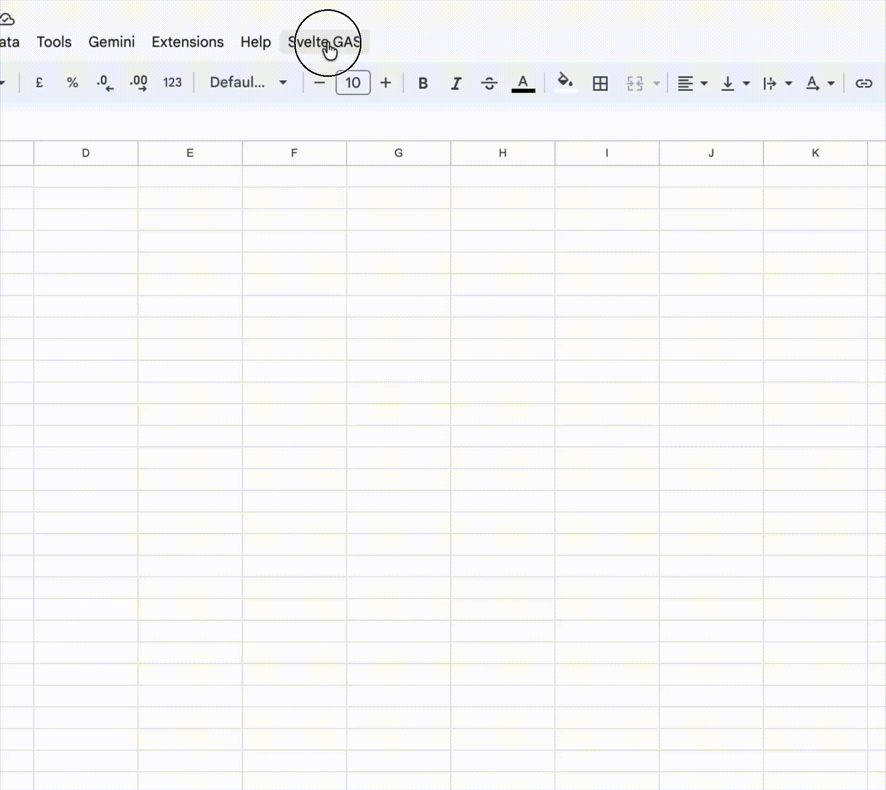

# Svelte Google Apps Script

This is a template for building Google Apps Script projects using TypeScript, Svelte and Vite. It uses the `clasp` command-line tool to manage your Apps Script projects and allows you to write your code in TypeScript, which is then compiled to JavaScript before being deployed to Google Apps Script.

More info can be found here:
https://developers.google.com/apps-script/guides/typescript



## Development

You will need to install the clasp tooling (@google/clasp)

> pnpm install

First time running clasp? make sure to login first, follow this guide:
https://developers.google.com/apps-script/guides/clasp

### Configure clasp environment

Copy the `.env.sample` & `.clasp.json.sample` examples and rename then to `.env` and `.clasp.json`.

In the `.env` you can add your development and production environment Script IDs. This is optional but it allows you to easily switch between different environments (e.g. development and production) without having to manually update the script ID in the `.clasp.json` file each time.

You can choose to use just one environment if that is what is you have. Just update the `.clasp.json` file with the script ID for that environment and you can ignore the `.env` file.

To find the Google Apps Script ID for your project:
- Open Apps Script project
- click "Project Settings"
- Under "IDs", copy the Script ID and paste it either in the `.env` file or directly in the `.clasp.json` file depending on how you want to manage your environments.

<br />

In order to switch between environments, you can use the `pnpm switch-env <env>` command.
It will simply update your `.clasp.json` with the script ID for that environment.

Then you are ready to make changes make your changes
```
> pnpm build
> pnpm push (or manually "clasp push")
```

## Examples

### Dialogs

You can find an example of a dialog already set up in the `src/client` folder. You can use this as a starting point for building your own UI using Svelte.

Each dialog is defined as a Svelte application in the `src/client` folder. You can create as many dialogs as you need, and each one will be compiled to a separate JavaScript file that can be deployed to Google Apps Script.

Make sure to update the `src/server/index.ts` file to include the necessary functions to serve your dialogs and handle any server-side logic you may need.

Also include the dialog in the `vite.config.ts` file to ensure it gets built and included in the deployment.

The example "about" dialog contains a simple Svelte component that interacts with the Google Apps Script backend server and get a response back. You can use this as a reference for how to set up communication between your Svelte components and the Google Apps Script backend.

### Storybook Stories

You can find an example of a Storybook story in the `src/stories` folder. This is a great way to develop and test your UI components in isolation before integrating them into your dialogs and speed up development.

Building applications for Google Apps Script can be a bit tricky, especially when it comes to testing and debugging. Storybook allows you to create a visual representation of your components and test them in isolation, which can help you catch issues early on and ensure that your UI is working as expected.
